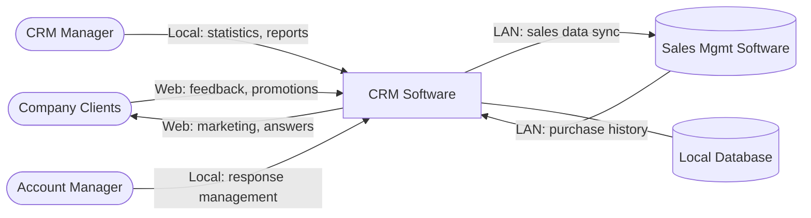

# Software Glance

> **Step 2 of 5** in the Problem-Based SRS process.

---

## Scope

| Aspect | Boundary |
|--------|----------|
| **This skill does** | Design the first abstract representation of a software solution |
| **This skill does NOT** | Specify Customer Needs, define Software Vision, or write Requirements |
| **Input from** | Step 0: Business Context (business-context skill) + Step 1: Customer Problems (customer-problems skill) |
| **Output to** | Step 3: Customer Needs (customer-needs skill) |

---

## Definition

A **Software Glance (SG)** is the rough idea of a software solution that emerges after understanding customer problems. It represents what is in the software analyst's mind as an abstract view of the solution—the very first representation before detailed analysis.

**What a Software Glance IS:**
- A high-level description of what the software will do (natural language narrative)
- An identification of system boundaries, actors, and interfaces
- A conceptual view of main components and data needs
- A Mermaid UML diagram showing system boundaries, actors, and interactions (mandatory)

**What a Software Glance is NOT:**
- Customer Needs (outcomes the software must provide) → Step 3
- Software Vision (detailed positioning, stakeholders, features, architecture) → Step 4
- Software Requirements (functional/non-functional specs) → Step 5

> **SG vs Software Vision:** The Software Glance is a rough starting point; the Software Vision (Step 4) enhances it with positioning, stakeholder analysis, feature lists, architecture decisions, and environment constraints. Do not add these details here.
>
> 🔗 **See also:** [Software Vision (Step 4)](../software-vision/SKILL.md) — drills down from this glance into detailed positioning, features, and architecture.

## Input (from Steps 0 and 1)

This skill expects output from the **business-context** skill and the **customer-problems** skill:

### 1. Business Context (from Step 0)
The structured business context document (`00-business-context.md`) containing project identity, business principles, stakeholders, domain boundaries, constraints, and success criteria. This provides the foundational understanding for designing the solution.

### 2. Customer Problems (CPs)
Problems expressed using this notation: `[Noun] [Verb] [Object] [Penalty]`

| Element | Description |
|---------|-------------|
| **Noun** | Subject suffering the problem (company, stakeholder, customer) |
| **Verb** | Severity: **must** (obligation), **expects** (expectation), **hopes** (hope) |
| **Object** | The difficulty that is the source of the problem |
| **Penalty** | Cost, pain, or consequence (optional if evident) |

> **Note:** If you don't have properly formatted CPs, first use the `customer-problems` skill.

## Task (Single Responsibility)

**Synthesize a Software Glance** by analyzing Customer Problems and producing an abstract solution view.

### Reasoning Steps

1. **For each CP**: Identify what solution element it implies (interface, data, integration)
2. **Group**: Cluster related implications into coherent components
3. **Identify actors**: Who will interact with the system?
4. **Identify integrations**: What existing systems are mentioned?
5. **Synthesize**: Combine into a cohesive high-level description

### Stop Criteria

**STOP** when you have produced:
- A narrative description of the software
- System boundary (actors + external systems)
- A Mermaid UML diagram of the system
- High-level components
- Interfaces table
- Data considerations
- Traceability to CPs

**DO NOT PROCEED** to specify Customer Needs, Software Vision, or Requirements.

## Output Template

```markdown
## Software Glance: [Solution Name]

### Description
[3-5 sentence narrative: what the software will do, who interacts with it, main interfaces, how data is managed. Use natural language, not bullet points.]

### System Diagram

```mermaid
%% Mermaid block diagram showing system boundaries, actors, and main interfaces
%% Use flowchart, C4Context, or block-beta as appropriate
```

### System Boundary

**Actors:**
- [Actor name]: [Role/interaction description]

**External Systems:**
- [System name]: [Integration purpose]

### High-Level Components
- **[Component]**: [Purpose in 1 sentence]

### Interfaces
| Interface | Type | Connected To | Purpose |
|-----------|------|--------------|---------|
| [Name] | [Web/LAN/API/Local] | [Actor/System] | [Brief purpose] |

### Data Considerations
[What data must be stored, where it originates, general persistence needs]

### Traceability
| CP | How Glance Addresses It |
|----|-------------------------|
| CP.1 | [Brief explanation] |
```

### Handoff to Next Step

After generating the Software Glance, instruct the user:

> ✅ **Software Glance complete.** To continue the Problem-Based SRS process:
> 
> **Next Step:** Use `customer-needs` skill to specify Customer Needs based on this Software Glance and the Customer Problems.
> 
> The Software Glance provides boundaries and direction for identifying what outcomes the software must provide.

## Constraints (Scope Boundaries)

| DO | DO NOT |
|----|--------|
| Keep descriptions conceptual | Specify functional requirements |
| Define system boundaries | Define software architecture patterns |
| Identify interfaces and actors | Detail interface behavior or protocols |
| Note data persistence needs | Design database schema |
| Trace back to CPs | Specify Customer Needs (that's Step 3) |
| Use natural language narrative | Use technical specifications |
| Use Mermaid UML diagrams for system overview | Create detailed architectural diagrams |

> **Boundary Check:** If you find yourself writing "The system shall..." or describing user stories, STOP—you are entering Requirements territory. Return to conceptual description.

---

## Example

**Input:**

Business Context:
> A company has strong difficulties to effectively build relationships with its clients and is convinced that an information system such as a CRM can contribute to reduce these difficulties.

Customer Problems:
- CP.1: The company **must** ensure communication channels with all clients **otherwise** loss of contact affecting sales.
- CP.2: The company **must** consider statistics about customer feedback **otherwise** customer dissatisfaction and losses.
- CP.3: Clients **expect** the company answers their feedbacks **otherwise** frustration and reputation decrease.
- CP.4: The company **must** align sales strategies with customers' behavior **otherwise** miss sales opportunities.

**Output:**

```markdown
## Software Glance: CRM Software

### Description
The CRM software will interact with clients through a web interface allowing marketing, promotions, receiving feedbacks, and sending answers to clients. The CRM software will provide local interfaces to interact with the Manager. Data about clients, feedbacks, and sales history will be stored in a local database. The CRM software will include a LAN interface with the Sales Management Software.

### System Diagram



### System Boundary

**Actors:**
- Company Clients: Submit feedback, receive promotions and marketing
- CRM Manager: Views statistics, analyzes customer relationships
- Account Manager: Manages client interactions, responds to feedback

**External Systems:**
- Sales Management Software: Provides sales history and purchase data

### High-Level Components
- **Web Portal**: Client-facing interface for communication and feedback
- **Management Interface**: Internal dashboard for managers
- **Database**: Persistent storage for client and interaction data
- **Integration Module**: Connection to existing Sales Management Software

### Interfaces
| Interface | Type | Connected To | Purpose |
|-----------|------|--------------|---------|
| Client Portal | Web | Company Clients | Marketing, feedback, promotions |
| Manager Dashboard | Local | CRM Manager, Account Manager | Statistics, response management |
| Sales Integration | LAN | Sales Management Software | Sales data synchronization |

### Data Considerations
Client contact information, feedback records, interaction history, and sales data stored locally. Data originates from client web submissions and Sales Management Software integration.

### Traceability
| CP | How Glance Addresses It |
|----|-------------------------|
| CP.1 | Web interface provides communication channel |
| CP.2 | Database stores feedback; Manager interface shows statistics |
| CP.3 | Manager interface enables viewing and responding to feedback |
| CP.4 | Integration with Sales Management provides behavior data |
```

---

## Validation Checklist

Before accepting the Software Glance output:

- [ ] Every CP appears in Traceability table with explanation
- [ ] Description is narrative style (3-5 sentences, not bullets)
- [ ] Mermaid UML diagram included showing system boundaries, actors, and interfaces
- [ ] No functional requirements or "shall" statements specified
- [ ] No Customer Needs specified (that's Step 3)
- [ ] No architecture patterns or technology choices (that's Step 4)
- [ ] System boundary clearly separates actors from external systems
- [ ] Each actor has a corresponding interface in the Interfaces table
- [ ] Data considerations address what CPs require

> **Scope Violation Check:** If output contains user stories, detailed features, architecture decisions, or requirement specifications, reject and regenerate focusing only on the abstract solution view.

---

## Process Navigation

| Step | Skill | Status |
|------|-------|--------|
| 0 | business-context | ← Input |
| 1 | customer-problems | ← Input |
| **2** | **software-glance** | **Current** |
| 3 | customer-needs | → Next |
| 4 | [software-vision](../software-vision/SKILL.md) | 🔗 Drills down from this glance |
| 5 | functional-requirements | |

**Next:** Use the Software Glance output with `customer-needs` skill to specify what outcomes the software must provide.

---

## Reference

- Gorski & Stadzisz (2016). *Problem-Based Software Requirements Specification*

**Version:** 1.2  
**Step:** 2 of 5  
**Next:** customer-needs skill
