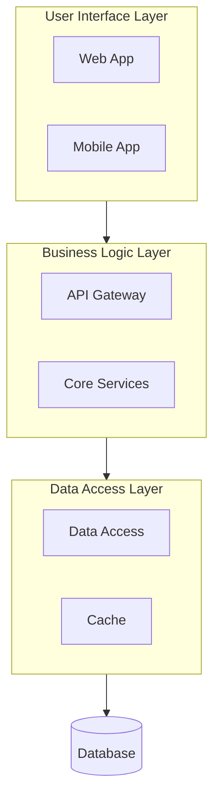

# Software Vision

## Overview
**Step 4 of 5** in the Problem-Based SRS methodology.

**Single Responsibility**: Transform the Software Glance + Customer Needs into a detailed Software Vision document that provides high-level scope, positioning, and architectural boundaries.

**Position in Process**:
```
Step 1: Customer Problems → Step 2: Software Glance → Step 3: Customer Needs
                                           ↓                        ↓
                                  Step 4: SOFTWARE VISION (You are here)
                                           ↓
                                  Step 5: Requirements Specification
```

## Purpose

Generate a Software Vision document that serves as:
- **Requires**: Software Glance (Step 2) + Customer Needs (Step 3)
- **Feeds into**: Software Requirements Specification (Step 5)
- **Scope definition**: Establishes clear boundaries to keep requirements within scope
- **Stakeholder agreement**: A high-level view all parties can review and approve

🔗 **See also:** [Software Glance (Step 2)](../software-glance/SKILL.md) — the initial abstract solution view that this Vision elaborates upon. Use the Glance to review system boundaries and actors before building the Vision.

## Prerequisites (Required Inputs)

This skill **REQUIRES** completed artifacts from previous steps:

1. **Software Glance** (from software-glance skill)
   - Location: Provide file path or paste content
   - Contains: Initial rough idea of software solution with directives
   
2. **Customer Needs** (from customer-needs skill)
   - Location: Provide file path or paste content
   - Contains: List of desired outcomes the software must provide

**⚠ Warning**: Do not proceed without these inputs. The Vision cannot be created independently.

## Your Task

Transform the Software Glance into a detailed Vision document by:
1. **Elaborating** the glance with specific positioning and features
2. **Incorporating** all relevant Customer Needs into the vision
3. **Defining** scope boundaries to guide the next step (Requirements Specification)
4. **Describing** high-level architecture (NOT complete architecture design)
5. **Establishing** stakeholder agreement on software direction

### What This Step DOES:
✅ Provides high-level scope and positioning  
✅ Lists major features at conceptual level  
✅ Defines environmental constraints  
✅ Shows high-level architecture blocks  
✅ Identifies all stakeholders  

### What This Step DOES NOT Do:
❌ Create detailed functional requirements (Step 5)  
❌ Design complete software architecture (later design phase)  
❌ Specify low-level implementation details  
❌ Go beyond high-level architectural decisions

### Vision Document Structure

Generate a document with these sections:

#### 1. **Positioning Statement**
```
For [target customer]
Who [statement of need or opportunity]
The [product name] is a [product category]
That [key benefit, compelling reason to buy/use]
Unlike [primary competitive alternative]
Our product [statement of primary differentiation]
```

#### 2. **Stakeholders**
List all parties involved:
- End users and their roles
- Development team members
- Business sponsors/owners
- External systems/integrations
- Support and maintenance teams

#### 3. **Product Overview**
Describe:
- **Purpose**: What problem does this software solve?
- **Scope**: What is included and what is explicitly excluded?
- **Key Benefits**: Top 3-5 value propositions
- **Success Metrics**: How will success be measured?

#### 4. **High-Level Features**
For each major feature:
- Feature name and brief description
- Primary benefit to users
- Priority level (Must-have, Should-have, Nice-to-have)

Example format:
| Feature | Description | Benefit | Priority |
|---------|-------------|---------|----------|
| Contact Management | Store and organize customer information | Centralized customer data | Must-have |

#### 5. **Environment and Constraints**
Specify:
- **Deployment Environment**: Cloud, on-premise, hybrid, mobile
- **Technical Constraints**: Platform, language, framework preferences
- **Integration Requirements**: Systems that must connect
- **Security Requirements**: Authentication, authorization, data protection
- **Performance Requirements**: Response time, scalability expectations
- **Compatibility Requirements**: Browsers, devices, OS versions

#### 6. **High-Level Architecture**
Provide using **Mermaid UML diagrams** (mandatory):
- Block/component diagram showing major subsystems
- Key interfaces and data flows
- External system connections
- Technology stack recommendations (high-level)

Use Mermaid diagram types as appropriate:


**Recommended Mermaid diagram types:**
- `flowchart` — for component/subsystem relationships
- `C4Context` / `C4Container` — for system context and container views
- `sequenceDiagram` — for key interaction flows
- `classDiagram` — for domain model overview

> 🔗 **Cross-reference:** The system boundaries and actors defined in the [Software Glance (Step 2)](../software-glance/SKILL.md) should be expanded here with architectural detail. Readers can refer back to the Glance for the original abstract view.

### Best Practices

1. **Trace to Inputs**: Every feature should trace back to Software Glance or Customer Needs
2. **High-Level Only**: Stay conceptual - detailed requirements come in Step 5
3. **Boundary Setting**: Explicitly state what is OUT of scope
4. **Stakeholder Review**: Vision must be reviewable by both technical and business stakeholders
5. **Architecture ≠ Design**: Show major subsystems, not detailed architecture
6. **Scope Guard**: This document guards Step 5 from scope creep

### Output Format (CRITICAL)

Provide the vision as a structured markdown document **directly in the response**. The full document content MUST be visible in the conversation—do NOT return only a summary or file listing.

**Required markdown headings** (use these exact headings):
- `## Vision` or `## Positioning` — the positioning statement section
- `## Stakeholders` — list of stakeholders
- `## Product Overview` — purpose, scope, benefits
- `## High-Level Features` — feature table
- `## Environment and Constraints` — deployment, technical constraints
- `## High-Level Architecture` — architecture blocks

Additional formatting:
- Tables for structured data (features, stakeholders)
- **Mermaid UML diagrams** for architecture (mandatory) and other visuals (preferred)
- Concise, scannable content

### Validation Checklist

**Input Validation**:
- [ ] Software Glance content is referenced/incorporated
- [ ] Customer Needs are explicitly addressed
- [ ] Each feature traces to a glance directive or customer need

**Output Validation**:
- [ ] Positioning statement clearly defines software purpose
- [ ] All stakeholders identified (users, developers, external systems)
- [ ] 5-10 high-level features listed (NOT detailed requirements)
- [ ] Environment and constraints specified
- [ ] Mermaid UML architecture diagram included (mandatory)
- [ ] Scope boundaries clearly defined (what's IN and OUT)
- [ ] Cross-reference to Software Glance for system boundary context

**Boundary Validation**:
- [ ] Stays at high-level (no detailed functional requirements)
- [ ] Architecture is conceptual blocks only (not complete design)
- [ ] Ready to feed into Step 5: Requirements Specification
- [ ] Can be reviewed and approved by stakeholders

---

## Handoff to Next Step

When Vision is complete:

```
✅ Step 4 Complete: Software Vision Defined

Summary:
- Positioning statement defined
- [N] stakeholders identified
- [N] high-level features listed
- Architecture overview complete

→ Next Step: 5 - Functional Requirements
→ Use skill: functional-requirements
→ Input: Customer Needs + Software Vision
```

---

## Process Integration

### Upstream Dependencies (Required Before This Step)
- **Step 1**: Customer Problems (customer-problems skill)
- **Step 2**: [Software Glance](../software-glance/SKILL.md) (software-glance skill) — 🔗 refer back for system boundaries and actors
- **Step 3**: Customer Needs (customer-needs skill)

### Downstream Artifacts (What Uses This Output)
- **Step 5**: Functional Requirements (functional-requirements skill)

## Key Methodological Notes

1. **Sequential vs Iterative**: While shown sequentially, this process supports iterative/incremental approaches
2. **Causal Dependencies**: Vision depends on Glance + Needs; cannot skip steps
3. **Scope Boundary**: Vision sets the boundary for Step 5 requirements to prevent scope creep
4. **Input Traceability**: All vision content should trace to glance directives or customer needs

## References

- **Primary**: Problem-Based SRS methodology (Gorski & Stadzisz, 2016)
- **Template Source**: IBM Rational Unified Process (RUP) Vision Document
- **Standards**: IEEE 830 Software Requirements Specification

---

**Version:** 1.2  
**Step:** 4 of 5  
**Next:** functional-requirements skill


