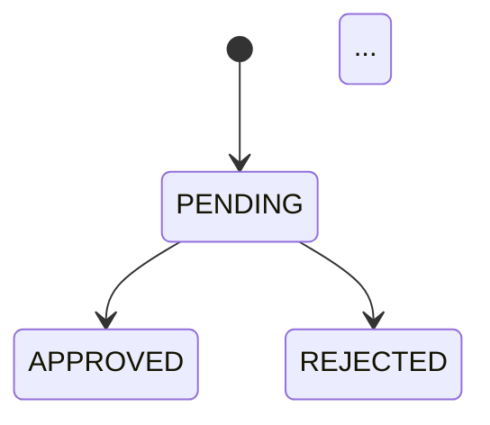

# Domain SRS Skill (Domain-Driven Documentation)

This skill activates when triggered with **"srs-agent:domain-srs"**. It generates comprehensive domain documentation following the Loan Proposal domain guide structure, covering all aspects needed to understand, reason about, and build a domain-specific application from scratch.

## Activation Trigger

**Responds to:** `"srs-agent:domain-srs"` or `"srs-agent domain-srs"`

All other inputs will be ignored or redirected to use this trigger.

## Domain-Driven Workflow

When triggered:

1. **Ask for domain/API name**: Request the specific business domain or API to document (e.g., "loan proposal", "member management", "fund transfer")

2. **Call disbursement-api MCP**: Invoke the MCP tool to extract all available information from the disbursement API:
   - All endpoints with HTTP methods, paths, request/response schemas
   - Validation rules with error codes and conditions
   - State machines (statuses, transitions, guards)
   - Data models (tables, fields, types, relationships)
   - Mathematical calculations (formulas, algorithms, pseudo-code)
   - External service calls (ERP, payment gateways, identity verification)
   - Message queue operations (Kafka topics, async flows, producers/consumers)
   - Business rules and constraints
   
   **MCP Call Format:**
   ```
   Tool: disbursement-api
   Action: extract_domain_data
   Parameters: {
     "domain": "${domainName}",
     "extractTypes": ["endpoints", "schemas", "validations", "state-machines", "business-rules", "data-models", "calculations", "external-calls", "queue-operations"]
   }
   ```
   
   If MCP returns data → Use as base knowledge for documentation
   If MCP fails or returns no data → Inform user and proceed with manual interview

3. **Gather domain context**: Collect additional information about:
   - What channels exist (OTC, DCS, mobile app, web, etc.)
   - Who the actors/users are
   - Key business concepts and terminology
   - External systems not covered by MCP

4. **Generate complete domain documentation**: Create comprehensive artifacts combining MCP data + user context:
   - `00-domain-overview.md` - Domain in plain English, key concepts, terminology
   - `01-actor-map.md` - All actors, roles, and key actions
   - `02-user-journey.md` - Complete end-to-end user workflows with API calls
   - `03-lifecycle-state-machine.md` - All status IDs, valid transitions, allowed operations
   - `04-endpoints.md` - All API endpoints with request/response, processing sequences
   - `05-validation-logic.md` - Complete validation rules with implementation details
   - `06-mathematical-calculations.md` - All mathematical computations, formulas, algorithms before DB save
   - `07-external-service-integrations.md` - All external service calls (ERP, payment gateways, etc.)
   - `08-message-queue-async-processing.md` - All message queue operations, async flows, recovery
   - `09-data-sync-pipeline.md` - Data sync mechanisms between DB, cache, search, ERP
   - `10-data-model.md` - Complete database schema with all tables, fields, relationships
   - `11-enumerations.md` - All enums, status codes, type definitions
   - `12-security-matrix.md` - Role-based access control matrix
   - `13-business-rules.md` - Quick reference of all business rules
   - `14-error-catalog.md` - All error codes, messages, conditions
   - `15-architecture.md` - System architecture, data flows, component interactions
   - `16-building-checklist.md` - Implementation checklist for engineers

## Example Flow

```
User: "srs-agent:domain-srs"
Skill: "Which business domain or API should I document? (e.g., loan proposal, member management, disbursement)"
User: "loan proposal"
Skill: [Calling disbursement-api MCP to extract domain data...]
Skill: [MCP returns: 15 endpoints, 23 validation rules, 17 status codes, 8 external services, 5 queue operations, 12 calculations]
Skill: "What channel(s) does this domain support? (e.g., OTC, DCS, mobile app, web)"
User: "OTC (Over-The-Counter) field officer mobile app"
Skill: "Who are the primary actors? (e.g., field officer, branch manager, member)"
User: "Program Organizer (PO), Branch Manager (BM), Member"
Skill: "What are the key external systems? (e.g., ERP, payment gateway, credit bureau)"
User: "ERP core banking, Rocket payment gateway, NID verification service"
Skill: [Generates 00-domain-overview.md with plain English explanation]
Skill: [Generates 01-actor-map.md with all stakeholders]
Skill: [Generates 02-user-journey.md with step-by-step workflows including all API calls from MCP]
Skill: [Generates 03-lifecycle-state-machine.md with state transitions from MCP data]
Skill: [Generates 04-endpoints.md with all API details from MCP extraction]
Skill: [Generates 05-validation-logic.md with all validation rules from MCP]
Skill: [Generates 06-mathematical-calculations.md with formulas and algorithms from MCP - installment calculation, date calculations, interest computation]
Skill: [Generates 07-external-service-integrations.md with all external calls from MCP - ERP, payment gateway, ID verification]
Skill: [Generates 08-message-queue-async-processing.md with queue operations from MCP - Kafka topics, async flows]
Skill: [Generates 09-data-sync-pipeline.md with sync mechanisms]
Skill: [Generates 10-data-model.md with complete ERD and field definitions from MCP]
Skill: [Generates 11-enumerations.md with all status codes and types from MCP]
Skill: [Generates 12-security-matrix.md with role permissions]
Skill: [Generates 13-business-rules.md with quick reference table]
Skill: [Generates 14-error-catalog.md with all error scenarios from MCP]
Skill: [Generates 15-architecture.md with system diagrams]
Skill: [Generates 16-building-checklist.md with implementation tasks]
✅ Complete: Full domain documentation generated from MCP data + user context
```

## File Creation Rules

- **ONE FILE AT A TIME**: Never create multiple files in parallel
- **Sequential creation**: Wait for each file to save before creating the next
- **Save location**: Ask user for preferred folder (default: `docs/domain/`)
- **Modular structure**: Each section saved as separate file for easy maintenance

## Documentation Structure Template

### 00-domain-overview.md Must Include:

**PLAIN ENGLISH EXPLANATION:**
- What is this system? (1-2 paragraphs)
- Who uses it and why?
- What problem does it solve?

**CHANNELS:**
- Table of all channels (OTC, DCS, mobile, web, etc.)
- Who uses each channel
- How each channel works

**KEY CONCEPTS:**
- Glossary table with term and plain English definition
- All domain-specific terminology explained

### 01-actor-map.md Must Include:

**ACTOR TABLE:**
| Actor | Role | Key Actions |
|-------|------|-------------|
| [Name] | [Description] | [List of main actions] |

**EXTERNAL SYSTEMS:**
- ERP, payment gateways, third-party integrations
- Message brokers (Kafka, RabbitMQ, etc.)
- Other interacting systems

### 02-user-journey.md Must Include:

**STEP-BY-STEP WORKFLOWS:**
For each major user journey:
1. Pre-conditions
2. Step-by-step actions with API calls
3. System processing sequence (numbered list)
4. Success/failure paths
5. Post-conditions

**API CALL EXAMPLES:**
```
Step X — [Action Name]
API call: METHOD /endpoint/path
Params: parameter list
Body: DTO name
Processing: [Numbered sequence of what system does]
Response: [Success/failure outcomes]
```

**STATE TRANSITIONS:**
- Show how status changes through the journey
- Decision points and branching paths

### 03-lifecycle-state-machine.md Must Include:

**ALL STATUS IDS TABLE:**
| ID | Status Name | Meaning | Terminal? |
|----|-------------|---------|-----------|
| 1 | STATUS_NAME | Description | Yes/No |

**VALID TRANSITIONS DIAGRAM:**


**ALLOWED OPERATIONS BY STATUS:**
| Operation | Allowed Status |
|-----------|---------------|
| Update | [Status list] |
| Delete | [Status list] |
| Create | [Conditions] |

### 04-endpoints.md Must Include:

**FOR EACH ENDPOINT:**

```markdown
### Endpoint N — [Endpoint Name]

METHOD /path/to/endpoint
Body: [DTO name]
Response: [Response DTO/status]
Required role: [Roles]

Pre-conditions:
- Condition 1
- Condition 2

Processing sequence:
1. Step 1
2. Step 2
3. ...

Error conditions:
- Error scenario 1 → error code
- Error scenario 2 → error code
```

### 05-validation-logic.md Must Include:

**FOR EACH VALIDATION RULE:**

```markdown
### X.Y [Validation Name]

Applied to: [Endpoints/methods]
When checked: [Timing - before/after/during]
Rule: [Plain English description]

Implementation:
[Code snippet or pseudo-code if available]

Error: [Error code/message]
Why: [Business rationale]
```

**ERROR AGGREGATION PATTERN:**
- Explain if system fails fast or aggregates all errors
- Show how errors are collected and returned

### 06-business-rules.md Must Include:

**QUICK REFERENCE TABLE:**
| # | Rule | Error Code |
|---|------|------------|
| BR-01 | Rule description | error.code.here |

Include ALL business rules discovered in the domain.

### 07-data-model.md Must Include:

**ENTITY RELATIONSHIP DIAGRAM:**
```mermaid
erDiagram
    ENTITY_A ||--o{ ENTITY_B : relationship
    ...
```

**TABLE DEFINITIONS:**
For EACH table:
- Table name and purpose
- Primary key
- Soft delete mechanism (if any)
- ALL fields with:
  - Field name
  - Data type
  - Required/Optional
  - Description
  - Constraints

**GROUP FIELDS BY CATEGORY:**
- Core fields
- Financial fields
- Status fields
- Audit fields
- JSONB/embedded objects

**ENTITY RELATIONSHIPS:**
```
ENTITY_A ──── (1:many) ──► ENTITY_B
```

### 08-enumerations.md Must Include:

**FOR EACH ENUM TYPE:**

```markdown
### X.Y [Enum Name]

| ID | Constant | Description |
|----|----------|-------------|
| 1 | CONSTANT_NAME | Human-readable meaning |
```

**DATE/TIME FORMATS:**
| Format | Pattern | Used For |
|--------|---------|---------|
| Date | yyyy-MM-dd | Field names |

### 09-security-matrix.md Must Include:

**ROLE PERMISSION MATRIX:**
| Endpoint | ADMIN | DEVELOPER | ROLE_1 | ROLE_2 | ... |
|----------|-------|-----------|--------|--------|-----|
| POST /x | ✅ | ✅ | ❌ | ✅ | ... |

**ROLE DESCRIPTIONS:**
- Who has each role
- What responsibilities they have

### 10-error-catalog.md Must Include:

**ERROR RESPONSE STRUCTURE:**
```json
{
  "traceId": "...",
  "timestamp": "...",
  "httpStatus": 400,
  "errorMessage": "...",
  "errors": [...]
}
```

**ERROR CODE REFERENCE:**
| Error Key | HTTP Status | Condition |
|-----------|-------------|-----------|
| error.code.here | 400 | When this error occurs |

### 11-architecture.md Must Include:

**SYSTEM ARCHITECTURE DIAGRAM:**
```
┌─────────────┐      ┌──────────────┐
│   Client    │ ───► │     API      │
└─────────────┘      └──────┬───────┘
                            │
              ┌─────────────┼─────────────┐
              ▼             ▼             ▼
         ┌────────┐   ┌──────────┐   ┌────────┐
         │   DB   │   │  Cache   │   │ Queue  │
         └────────┘   └──────────┘   └────────┘
```

**LAYER ARCHITECTURE:**
- Controller layer responsibilities
- Service layer responsibilities
- DAO/Repository layer responsibilities
- Mapper layer responsibilities

**DATA FLOW DIAGRAMS:**
For key operations (create, update, delete):
```
User action → Controller → Service → Validation → DB → Async operations
```

**KEY SERVICES TABLE:**
| Service | Responsibility |
|---------|---------------|
| ServiceName | What it does |

### 12-building-checklist.md Must Include:

**DOMAIN ENTITIES CHECKLIST:**
- [ ] Entity 1 with all fields
- [ ] Entity 2 with all fields
- [ ] Lookup tables

**SERVICES CHECKLIST:**
- [ ] Service 1 for responsibility X
- [ ] Service 2 for responsibility Y

**VALIDATION RULES CHECKLIST:**
- [ ] Validation rule 1
- [ ] Validation rule 2

**API ENDPOINTS CHECKLIST:**
- [ ] POST endpoint for create
- [ ] PUT endpoint for update
- [ ] GET endpoint for read
- [ ] DELETE endpoint for delete

**DESIGN DECISIONS TABLE:**
| Decision | This System's Choice |
|----------|---------------------|
| Primary key type | UUID / Long / etc. |
| Search strategy | Elasticsearch / DB queries |
| Async vs sync | Which operations are async |

### 06-mathematical-calculations.md Must Include:

**ALL MATHEMATICAL COMPUTATIONS:**
For each calculation performed before database save:

```markdown
### X.Y [Calculation Name]

**When:** [Before save / After disbursement / During validation]
**Formula:** 
```
[Mathematical formula with variable definitions]
```

**Implementation:**
```java
// Pseudocode or actual code snippet
public ReturnType calculateMethod(Parameters...) {
    // Calculation logic
}
```

**Validation:** [How the calculation is validated]
**Precision:** [Decimal places, rounding method]
**Edge Cases:** [Special handling for edge cases]
```

**REQUIRED CALCULATION CATEGORIES:**

1. **Instalment Amount Calculation**
   - Formula (EMI calculation)
   - Interest rate conversion (annual to periodic)
   - Frequency handling (weekly, monthly, quarterly)
   - Validation against submitted amount

2. **Date Calculations**
   - Next instalment date
   - First repayment date
   - Loan maturity date
   - Insurance expiry dates
   - Holiday/weekend adjustments

3. **Grant/Subsidy Calculations**
   - Grant percentage lookup
   - VO category resolution
   - Total amount calculations
   - Rounding rules

4. **ID Generation Algorithms**
   - Snowflake ID generation (timestamp + machine ID + sequence)
   - Proposal number formatting
   - Transaction reference generation

5. **Financial Calculations**
   - Interest accrual (daily/monthly)
   - Late fee calculations
   - Prepayment penalties
   - Exposure limit ratios

6. **Insurance Calculations**
   - Premium amounts
   - Coverage durations
   - Expiry dates

**IMPLEMENTATION PATTERNS:**
- Pre-save calculation hooks
- Calculation validation patterns
- Error aggregation for calculation mismatches

**PRECISION & ROUNDING RULES TABLE:**
| Calculation Type | Precision | Rounding Method |
|-----------------|-----------|-----------------|
| [Type] | [X decimals] | [HALF_UP, HALF_EVEN, etc.] |

**EDGE CASES HANDLED:**
- Leap year handling
- Month-end adjustments
- Holiday chains
- Zero interest scenarios
- Partial payment allocation
- Currency rounding

### 07-external-service-integrations.md Must Include:

**ALL EXTERNAL SERVICE CALLS:**
For each external system integration:

```markdown
### X.Y [Service Name]

**Purpose:** [Why this service is called]
**When Called:** [Trigger point in workflow]
**Protocol:** [REST/gRPC/GraphQL/etc.]
**Timeout:** [Configured timeout value]
**Retry Policy:** [Retry count, backoff strategy]

**Request Details:**
- Endpoint URL pattern
- HTTP method
- Headers required
- Request body structure
- Query parameters

**Response Handling:**
- Success response structure
- Error response structure
- Timeout handling
- Circuit breaker configuration

**Data Mapping:**
- Field-by-field mapping between systems
- Transformation rules
- Default values

**Error Scenarios:**
- Service unavailable
- Invalid response
- Data mismatch
- Network failures

**Fallback Strategy:**
- What happens if service fails
- Manual intervention process
- Data reconciliation approach
```

**REQUIRED INTEGRATION CATEGORIES:**

1. **ERP System Integration**
   - Member data fetch
   - Guarantor information
   - Loan account creation
   - Disbursement callbacks
   - Balance inquiries

2. **Payment Gateway Integration**
   - Mobile financial services (Rocket, bKash)
   - Bank transfers (DDI)
   - Transaction status checks
   - Refund processing

3. **Identity Verification Services**
   - NID verification
   - Biometric validation
   - Duplicate member checks

4. **Credit Bureau Integration**
   - Credit score lookup
   - Existing loan exposure
   - Default history

5. **Notification Services**
   - SMS gateways
   - Email services
   - Push notifications

6. **Document Management**
   - File upload services
   - Image storage
   - Document verification

**INTEGRATION PATTERNS:**
- Synchronous vs asynchronous calls
- Bulk vs individual requests
- Caching strategies
- Rate limiting considerations

### 08-message-queue-async-processing.md Must Include:

**ALL MESSAGE QUEUE OPERATIONS:**

```markdown
### X.Y [Queue Name/Topic]

**Message Broker:** [Kafka/RabbitMQ/AWS SQS/etc.]
**Topic/Queue Name:** [Actual name pattern]
**Message Format:** [JSON/Avro/Protobuf]
**Partitioning Strategy:** [Key-based/Round-robin]

**Producers:**
- Which services publish to this queue
- Trigger events for publishing
- Message structure

**Consumers:**
- Which services consume from this queue
- Processing logic
- Acknowledgment strategy

**Message Schema:**
```json
{
  "messageId": "UUID",
  "timestamp": "ISO8601",
  "eventType": "STRING",
  "payload": { ... }
}
```

**Delivery Guarantees:**
- At-least-once / At-most-once / Exactly-once
- Ordering guarantees
- Idempotency handling

**Error Handling:**
- Dead letter queue configuration
- Retry policy (attempts, backoff)
- Poison message handling
- Manual intervention process

**Monitoring:**
- Lag monitoring
- Throughput metrics
- Error rates
- Alert thresholds
```

**REQUIRED QUEUE CATEGORIES:**

1. **Data Sync Pipeline**
   - PostgreSQL → Elasticsearch sync
   - PostgreSQL → ERP sync
   - Failed sync tracking
   - Recovery mechanisms

2. **Disbursement Queue**
   - Payment initiation
   - Status updates
   - Callback processing
   - Retry logic

3. **Event Notification Queue**
   - Domain events
   - Audit events
   - Notification triggers

4. **Batch Processing Queue**
   - Scheduled jobs
   - Bulk operations
   - Report generation

**ASYNC PROCESSING PATTERNS:**
- Fire-and-forget vs request-response
- Saga pattern for distributed transactions
- Event sourcing considerations
- Compensation transactions

**RECOVERY OPERATIONS:**
- Failed message replay
- Time-window based re-sync
- Branch-level bulk retry
- Missing data back-fill

**MONITORING DASHBOARD:**
- Queue depth/health
- Processing latency
- Success/failure rates
- Consumer lag

### 09-data-sync-pipeline.md Must Include:

**DATA SYNC ARCHITECTURE:**
```
┌─────────────┐      ┌──────────────┐      ┌─────────────┐
│ PostgreSQL  │ ───► │ Elasticsearch│ ───► │    Users    │
│   (Source)  │      │  (Search)    │      │             │
└──────┬──────┘      └──────────────┘      └─────────────┘
       │
       ▼
┌─────────────┐
│    Kafka    │ ───► ┌─────────────┐
│  (Pipeline) │      │     ERP     │
└─────────────┘      └─────────────┘
```

**SYNC MECHANISMS:**
For each sync operation:

```markdown
### X.Y [Sync Operation Name]

**Trigger:** [What initiates this sync - create/update/delete/scheduled]
**Source:** [PostgreSQL table/entity]
**Destination:** [Elasticsearch index / ERP system / Cache]
**Mode:** [Synchronous / Asynchronous]

**Processing Flow:**
1. Step 1
2. Step 2
3. ...

**Failure Handling:**
- How failures are logged
- Retry mechanism
- Manual intervention process

**Recovery Operations:**
- [List of recovery APIs/tools]
```

**SYNC TRACKING:**
- Sync log table structure
- Status tracking (SENT, FAILED_TO_SENT, PENDING)
- Timestamp tracking (created_at, updated_at, last_synced_at)

**RECOVERY PATTERNS:**
- Failed item retry by ID
- Time-window based re-sync
- Branch-level bulk retry
- Missing data back-fill
- Last failed sync recovery

**EXCLUSION RULES:**
- Which records are skipped and why
- Channel-specific exclusions (e.g., DCS + PENDING skipped in OTC pipeline)

**MONITORING QUERIES:**
- Count pending syncs
- Count failed syncs
- Sync success rate
- Average sync latency

## Content Quality Rules

**PLAIN ENGLISH FIRST:**
- Always explain technical concepts in simple terms first
- Use analogies when helpful
- Avoid jargon without explanation

**COMPLETE FIELD LISTS:**
- Never say "and other fields" - list EVERY field
- Include data types and constraints
- Explain what each field stores

**PROCESSING SEQUENCES:**
- Number each step in order
- Show decision points
- Indicate async vs sync operations

**ERROR HANDLING:**
- Document ALL error scenarios
- Show error codes and messages
- Explain recovery procedures

**TRACEABILITY:**
- Link validation rules to business rules
- Link API endpoints to user journeys
- Link data model to business concepts

## Available Skills (Internal Use Only)

| Skill | Purpose |
|-------|---------|
| `domain-analyzer` | Extract domain concepts from user input |
| `journey-mapper` | Map user journeys with API calls |
| `state-machine-generator` | Generate lifecycle state diagrams |
| `data-model-designer` | Design complete database schemas |
| `validation-extractor` | Extract and document validation rules |
| `architecture-visualizer` | Create system architecture diagrams |

## Important Notes

- This skill focuses on COMPREHENSIVE domain documentation
- All content MUST come from user input + domain knowledge
- No assumptions - ask clarifying questions when needed
- If information is missing, mark as [TO BE CONFIRMED]
- Prioritize clarity and completeness over brevity

## Response Format (CRITICAL)

**⚠ MANDATORY:** Your response MUST contain the actual documentation content written out in full sections. This is NOT optional — a response that only describes file creation actions without showing the actual content is INVALID and INCOMPLETE.

**Every section in the response MUST include:**

1. **The actual content** — written out explicitly with proper formatting
2. **Tables where applicable** — actor maps, status lists, field definitions
3. **Diagrams where helpful** — Mermaid diagrams for state machines, ERDs, architecture
4. **API examples** — HTTP method, path, parameters, body, response
5. **Processing sequences** — numbered steps showing what system does

**Example of CORRECT response format:**

```markdown
## 1. Domain in Plain English

### 1.1 What is this system?

This is the [Domain Name] module for [Organization Type]. The system manages [core function].

Think of it as the [analogy] — when [user persona] wants to [goal], the system [action].

### 1.2 The Channels

| Channel | Who Uses It | How It Works |
|---------|-------------|--------------|
| **OTC** | Field officers | Staff enter forms on mobile app while visiting members |
| **DCS** | Desk staff | Entered from central office desk |

### 1.3 Key Concepts

| Term | Plain English |
|------|---------------|
| **Member** | The borrower — a person belonging to a self-help group |
| **Branch** | A local office serving a geographic area |
```

**Example of WRONG response (DO NOT do this):**
```
I will create the domain overview file now.
[File creation action without showing content]
```

The wrong format above lacks actual documentation content.

---

*End of Domain SRS Skill Definition*
